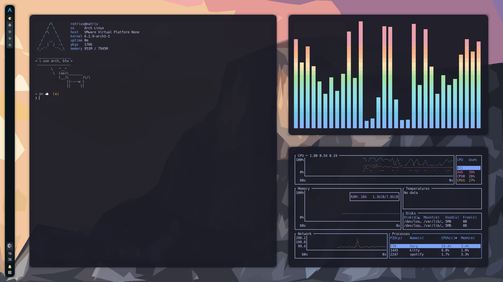
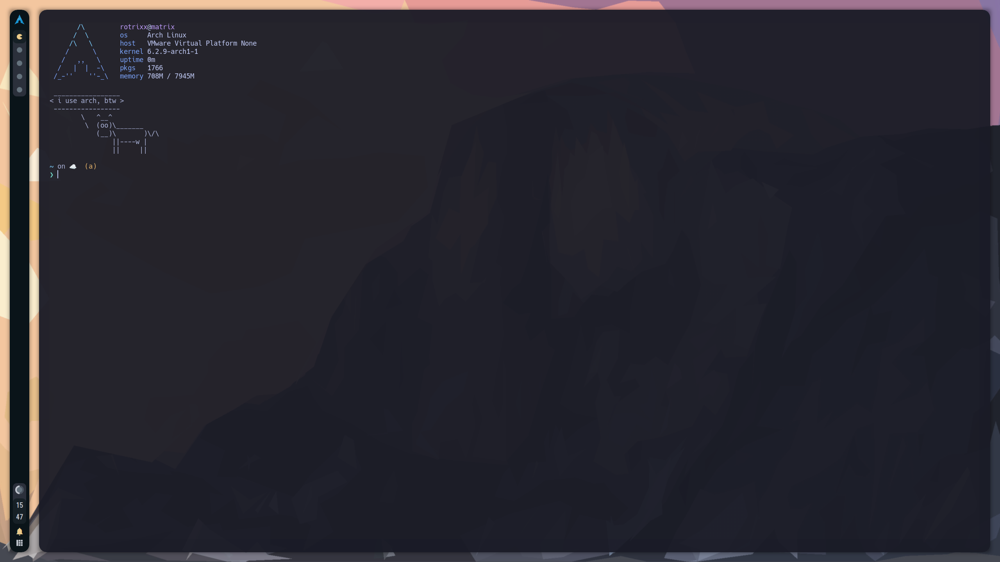
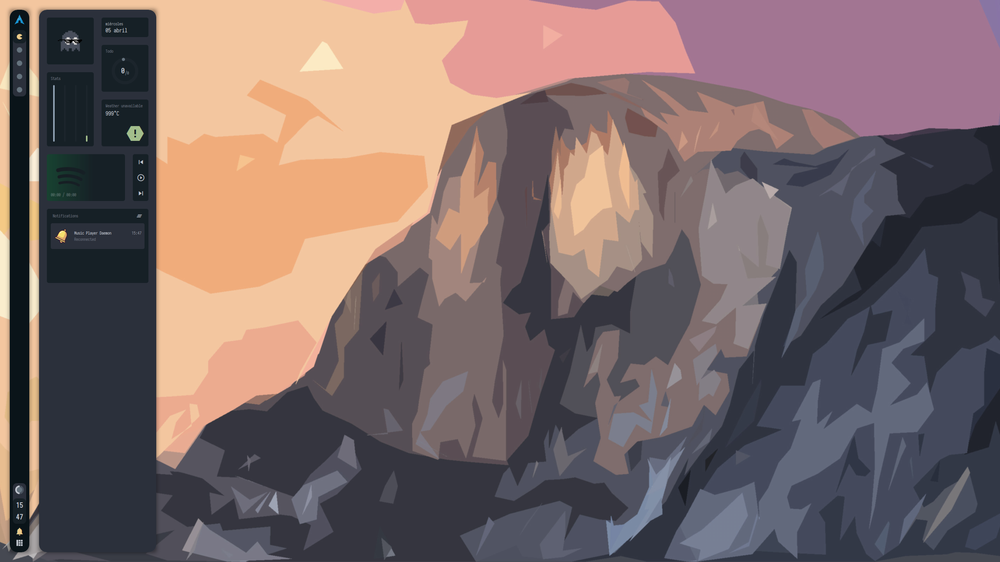
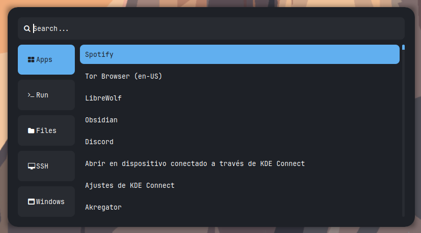

## rotrixx's dotfiles






<a href="https://awesomewm.org/"></a>

<b> <a href="https://github.com/rxyhn/yoru" target="_blank">Yoru</a> (夜) based Aesthetic and Beautiful Awesome Environment </b>

Welcome to my AwesomeWM configuration files!

This is my personal collection of configuration files based on [rxyhn's yoru rice](https://github.com/rxyhn/yoru) and [s4vitar's](https://github.com/s4vitar) modifications.

I changed some things like rofi, NvChad for AstroNvim, fzf theme...

AwesomeWM is the most powerful and highly configurable next-generation framework window manager for X.

<!-- INFORMATION -->

## :snowflake: ‎ <samp>Information</samp>

Here are some details about my setup:

- **OS:** [Arch Linux](https://archlinux.org)
- **WM:** [awesome](https://github.com/awesomeWM/awesome)
- **Terminal:** [kitty](https://sw.kovidgoyal.net/kitty/)
- **Shell:** [zsh](https://www.zsh.org/)
- **Editor:** [neovim](https://github.com/neovim/neovim)
- **Compositor:** [picom](https://github.com/yshui/picom)
- **Application Launcher:** [rofi](https://github.com/davatorium/rofi)
- **Music Player** [ncmpcpp](https://github.com/ncmpcpp/ncmpcpp) / [spotify](https://spotify.com)

<br>

<!-- PREPARATION -->

## :toolbox: ‎ <samp>Preparation</samp>

1. `git clone --depth=1 https://github.com/RotrixLOL/dotfiles .dotfiles`
2. `cd .dotfiles`
3. `chmod +x scripts/*`

<br>

<!-- SETUP -->

## :wrench: ‎ <samp>Setup</samp>

> This is step-by-step how to install yoru on your system. Just [R.T.F.M](https://en.wikipedia.org/wiki/RTFM).

<details>
<summary><b>1. Run `./scripts/bootstrap.sh`</b></summary>
<br>

> :warning: ‎ **This setup instructions only provided for Arch Linux (and other Arch-based distributions)**

This script will do all the installation process and [stow](https://www.gnu.org/software/stow/) configurations.

The script suposes you have a base installation with xorg and a Display Manager, also it suposes you have paru as AUR helper.
You are free to modify any script, you could remove some package or rust from `./scripts/install-packages.sh`.

</details>

<details>
<summary><b>2. Move `wallpapers` directory to $HOME and install fonts</b></summary>
<br>

```sh
mv wallpapers ~/wallpapers
```

> Install a few fonts (mainly icon fonts) in order for text and icons to be rendered properly.

Necessary fonts:

- **Roboto** - [here](https://fonts.google.com/specimen/Roboto)
- **Material Design Icons** - [here](https://github.com/google/material-design-icons)
- **Icomoon** - [here](https://www.dropbox.com/s/hrkub2yo9iapljz/icomoon.zip?dl=0)
- **Hack** - [here](https://github.com/ryanoasis/nerd-fonts/releases/download/v2.3.3/Hack.zip)

Once you download them and unpack them, place them into `~/.fonts` or `~/.local/share/fonts`.

And run this command for your system to detect the newly installed fonts.

```sh
fc-cache -fv
```

> Finally, now you can login with AwesomeWM

Congratulations, at this point you have installed my dotfiles! :tada:

Log out from your current desktop session and log in into AwesomeWM

</details>

You can change the wallpaper at the end of `.config/awesome/rc.lua`

## :heart: Thank You
My dotfiles are here thanks to these awesome people <3:
- [rxyhn](https://github.com/rxyhn) for his awesome base configuration
- [s4vitar](https://github.com/s4vitar) for his tutorial and various changes in base config
